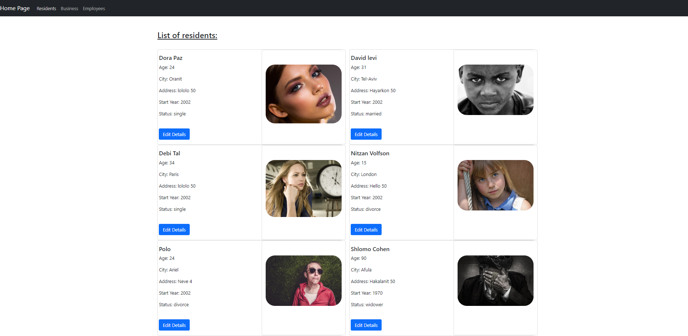
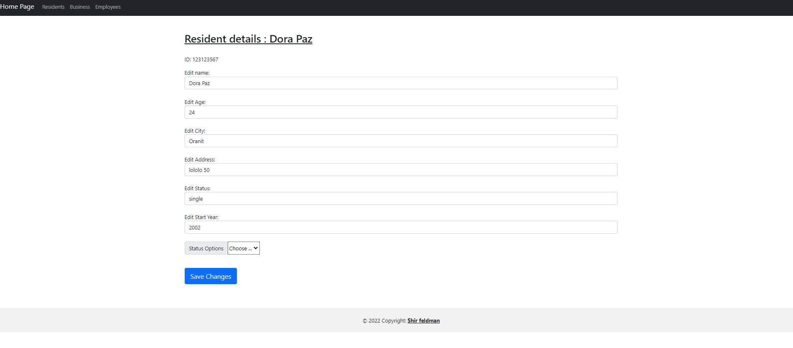
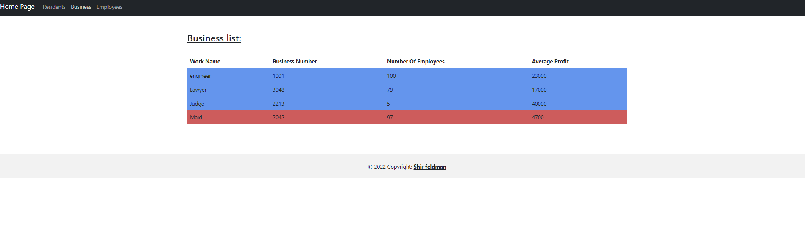
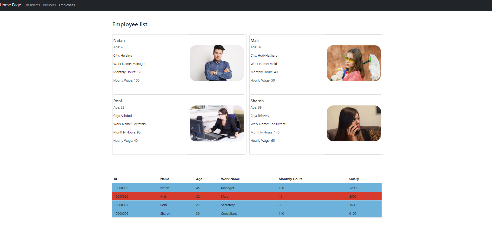

# ShirApp
> NOTE: ALL RIGHTS RESERVED TO Shir Feldman 

This project was generated with [Angular CLI](https://github.com/angular/angular-cli) version 13.2.5.
Run ng build to build the project. The build artifacts will be stored in the dist/ directory.

## **1. HOME PAGE**

  

## **2. Residents page**

  

## **3.Edit residents details Page**

  

## **4. Business Page**

  

## **5. Employees Page**

  

## **6.Navbar & Footer**

